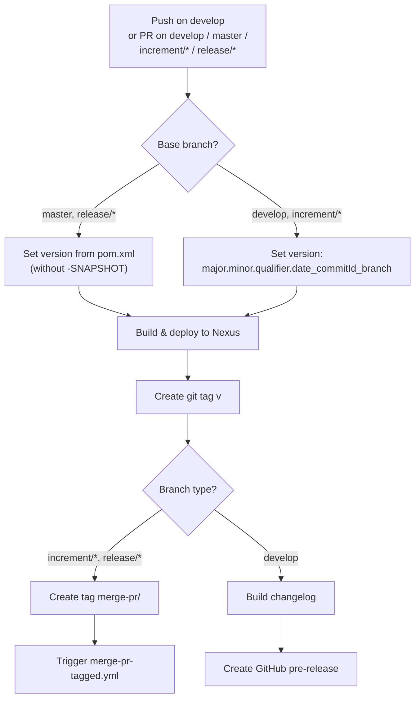
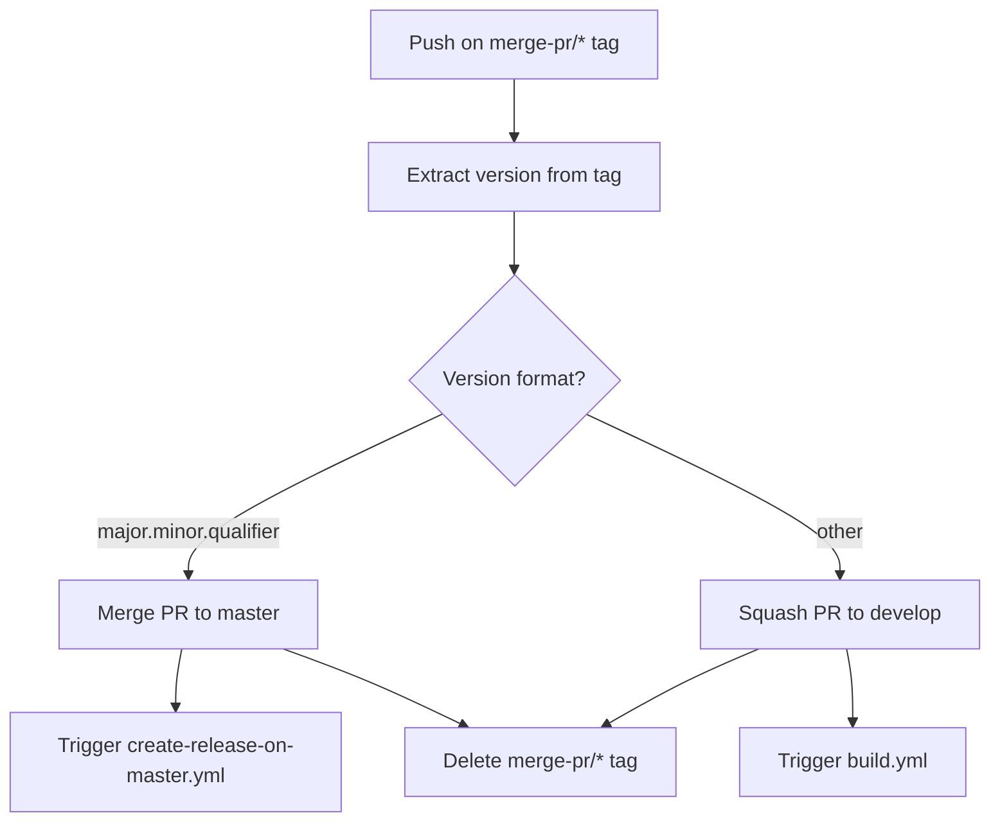
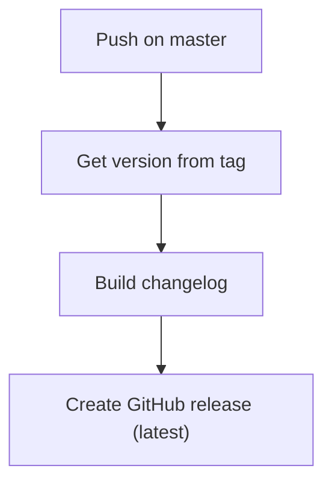
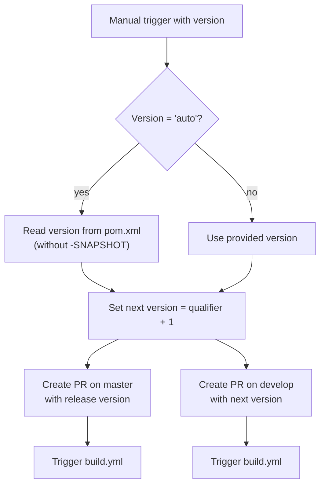

# Development Version and Branch Handling

This document describes the branching strategy, version numbering, CI/CD pipeline, and development workflow for this JUDO module.

## Branches

The versioning policy follows [GitFlow](https://www.atlassian.com/git/tutorials/comparing-workflows/gitflow-workflow):

| Branch Pattern | Purpose |
|---|---|
| `develop` | Main development branch — latest sources for the current active version |
| `feature/JNG-NUMBER_short_summary` | Feature branches based on `develop` — new functionality for the active version |
| `(release/)X_Y_betaN` | Release branches (the `release/` prefix is reserved for CI) |
| `bugfix/JNG-NUMBER_short_summary` | Bug fixes on release branches — must also be applied to newer release and develop branches |
| `support/JNG-NUMBER_short_summary` | Support branches on release branches — minor changes for a previous release |
| `master` | Latest released sources of the active version |

### Branch Flow

```mermaid
gitGraph
    commit id: "initial"
    branch develop
    commit id: "dev-1"
    branch feature/JNG-1
    commit id: "feat-1"
    commit id: "feat-2"
    checkout develop
    merge feature/JNG-1 id: "merge-feat-1"
    branch feature/JNG-3
    commit id: "feat-3"
    checkout develop
    merge feature/JNG-3 id: "merge-feat-3"
    branch release/1.0-beta1
    commit id: "rc-1"
    branch bugfix/JNG-4
    commit id: "bugfix"
    checkout release/1.0-beta1
    merge bugfix/JNG-4 id: "merge-bugfix"
    checkout develop
    merge release/1.0-beta1 id: "merge-release"
    checkout master
    merge release/1.0-beta1 id: "release-1.0"
```

## Version Numbers

Versions follow semantic versioning with these rules:

| Action | Version Change |
|---|---|
| Starting a `feature/` branch | No version change |
| Starting a release branch from `develop` | 2nd number (minor) incremented on `develop` |
| Starting a `bugfix/` branch | No version change — applied to release branches during pre-release testing |
| Starting a `support/` branch | 3rd number (patch) incremented |
| Starting a `hotfix/` branch | 4th number incremented — applied to both release and master |

## GitHub Actions CI/CD Pipeline

The CI/CD system consists of four interconnected workflows:

### build.yml — Main Build Pipeline



### merge-pr-tagged.yml — Pull Request Merge Automation



### create-release-on-master.yml — Release Publication



### release.yml — Manual Release Trigger



## How to Develop

For issue tracking, the project uses [JIRA](https://blackbelt.atlassian.net/jira/dashboards).

> **Important:** There is no commit without a ticket number. Every pull request and commit message must include a `JNG-xxx` reference.
