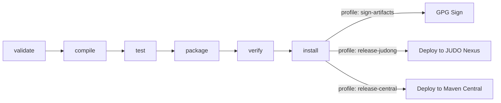

# Contributing to JUDO

## Development Environment

Before you start, make sure your environment meets these requirements (detailed in the [judo-community CONTRIBUTING guide](https://github.com/BlackBeltTechnology/judo-community/blob/develop/CONTRIBUTING.adoc)):

| Requirement | Version |
|---|---|
| Java JDK | 21 |
| Maven | 3.9.4+ (wrapper included via `./mvnw`) |

## Code Structure

This is a multi-module Maven project built with Tycho for Eclipse/OSGi compatibility. Modules are grouped by purpose:

### Adapter & Builder (Core Logic)

| Module | Description |
|---|---|
| `adapter-asm/` | Eclipse plugin — core ASM adapter implementing `ModelAdapter` for Expression-to-ASM bridging |
| `adapter-asm-test/` | Unit tests for the adapter (JUnit 5) |
| `builder-jql-asm/` | Eclipse plugin — JQL expression extractor and builder for ASM models |
| `builder-jql-asm-test/` | Unit tests for the builder (JUnit 5) |

### Eclipse Distribution

| Module | Description |
|---|---|
| `feature-adapter-asm/` | Eclipse feature descriptor — packages the adapter plugin for Eclipse installation |
| `feature-builder-jql-asm/` | Eclipse feature descriptor — packages the builder plugin for Eclipse installation |
| `site/` | Eclipse P2 Update Site — compiles all features into an installable update site |

### Integration Testing

| Module | Description |
|---|---|
| `osgi-itest/` | OSGi integration tests using Pax Exam and Apache Karaf runtime |

## Build Lifecycle



### Common Commands

```sh
# Full build
./mvnw clean install

# Run all tests
./mvnw clean test

# Run tests for a specific module
./mvnw clean test -pl adapter-asm-test

# Skip tests
./mvnw clean install -DskipTests
```

### Updating Eclipse P2 Category Versions

The JUDO update sites encode version numbers in their URLs. Since Tycho loads category definitions before version properties are available, a dedicated profile handles the replacement:

```sh
mvn clean install -P update-category-versions -f site/pom.xml
```

## Working with Eclipse

### Required Plugins

- m2e (Maven integration)
- Epsilon
- Eclipse Modeling Tools

### Installation

Install the plugin via the P2 update site: go to **Install New Software** in Eclipse, add the URL from the GitHub release page (or point to the uncompressed ZIP folder), and install the features.

### Code Generation

To run code generation inside Eclipse, execute the MWE2 Workflow:

```
hu.blackbelt.judo.meta.asm.model project → src/workflow/generateModel.mwe2
```

Required Eclipse features: XTend, XText, MWE, MWE2.

## Troubleshooting

### JUnit Tests in Eclipse

There is a known issue where Eclipse + Tycho does not include JUnit on the classpath automatically. A `Required-Bundle` entry has been added to the OSGi Manifest as a workaround (not Tycho's recommended approach). See [Eclipse Bug 534587](https://bugs.eclipse.org/bugs/show_bug.cgi?id=534587).

### Lombok

Tycho does not support Lombok generation directly ([lombok#285](https://github.com/rzwitserloot/lombok/issues/285)). No Lombok is used in this project — all source code is either hand-written or generated.

### Tycho Repository References

Tycho 1.4.0 and below does not handle repository references inside site definitions, so all referenced plugin sites must be added manually. See [Eclipse Bug 453708](https://bugs.eclipse.org/bugs/show_bug.cgi?id=453708).

## Version Policy

Maven and Eclipse have different version conventions:

| Convention | Example |
|---|---|
| Maven snapshot | `1.0.0-SNAPSHOT` |
| Eclipse qualifier | `1.0.0.qualifier` |

The Tycho Versions Plugin automatically converts between these formats during each build.

## Submission Guidelines

### Submitting an Issue

Before filing, search the [issue tracker](https://github.com/BlackBeltTechnology/judo-meta-asm/issues) for existing reports. When filing a new issue, include:

- Output of `java -version` and `mvn -version`
- `pom.xml` or `.flattened-pom.xml` (when applicable)
- A minimal reproduction case

### Submitting a Pull Request

This project follows [GitHub's standard forking model](https://guides.github.com/activities/forking/). Fork the project, create your feature branch, and submit a pull request.

> **Important:** All commits must reference a JIRA ticket (e.g., `JNG-123`). No commit without a ticket number.
