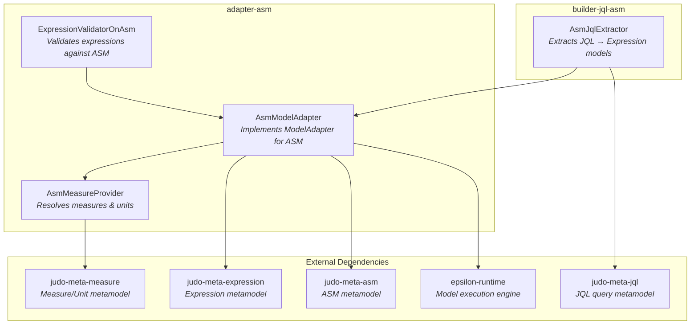
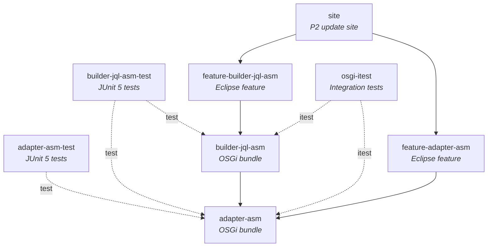

# judo-meta-expression-asm

## Introduction

This module bridges [Expression](https://github.com/BlackBeltTechnology/judo-meta-expression) models and [ASM (Abstract Structural Model)](https://github.com/BlackBeltTechnology/judo-meta-asm) models within the JUDO platform. It provides adapters that resolve references — such as type IDs, measure annotations, and attribute expressions — defined in Expression models to their corresponding ASM model elements at runtime.

The project consists of two main functional layers:

1. **Adapter layer** (`adapter-asm`) — Implements the generic `ModelAdapter` interface for ASM-specific types (EClass, EAttribute, EReference, etc.), enabling the expression evaluation engine to work with ASM models transparently.
2. **Builder layer** (`builder-jql-asm`) — Extracts JQL (JUDO Query Language) expressions from ASM models and builds corresponding Expression model trees.

## Architecture Overview

## Module Structure

## Key Classes

### AsmModelAdapter

The central class that implements `ModelAdapter<EClassifier, EDataType, EEnum, EClass, EAttribute, EReference, EClass, EAttribute, EReference, EClassifier, Measure, Unit>`. It provides:

- **Type resolution** — Maps `TypeName` and `MeasureName` to ASM model elements (`EClassifier`, `Measure`)
- **Type introspection** — Checks whether a type is numeric, boolean, string, date, enumeration, measured, etc.
- **Structural navigation** — Retrieves attributes, references, super types, container types, and transfer object mappings
- **Expression metadata** — Reads getter/setter/default/range annotations from ASM extension annotations
- **Measure integration** — Delegates to `AsmMeasureProvider` and `MeasureAdapter` for unit/dimension resolution

### AsmMeasureProvider

Implements `MeasureProvider<Measure, Unit>` backed by an EMF `ResourceSet` containing measure model instances. Handles:

- Measure and unit lookup by namespace, name, or symbol
- Base/derived measure decomposition
- Duration unit arithmetic support detection
- EMF change notification forwarding via `EContentAdapter`

### AsmJqlExtractor

Extends `AdaptableJqlExtractor` to provide ASM-specific JQL expression extraction. Accepts ASM, measure, and expression `ResourceSet` instances and creates the appropriate `AsmModelAdapter` internally.

## Context

This project is a building block of the [judo-community](https://github.com/BlackBeltTechnology/judo-community) aggregator project. See that project's documentation for how this module fits into the broader JUDO ecosystem.

## Contributing

See [CONTRIBUTING.md](CONTRIBUTING.md) for development environment setup, code structure details, and submission guidelines.

## License

This project is licensed under the [Eclipse Public License - v 2.0](https://www.eclipse.org/legal/epl-2.0/).
